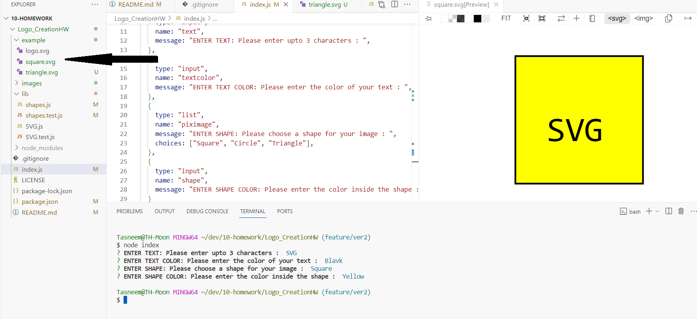

# Logo_Creation_Homework
  ## Description
  This week's challenge was to build a Node.js command-line application that takes in user input to generate a logo and save it as "logo.svg" in the example folder. The application prompts the user to provide text for the logo, decide the color of the text and the shape, and finally save the generated SVG file as "logo.svg".
  
  ## Table of Contents
  - [Installation](#installation)
  - [Usage](#usage)
  - [Credits](#credits)
  - [License](#license)
  - [Contributing](#contributing)
  - [Tests](#tests)
  - [Questions](#questions)
  ## Installation
  For installation, please install jest and use node and npm to test the code.
  ## Usage
  This application can be used to create Professional README pages for different homeworks / projects.
  - Here are the sample screenshots and walkthrough video....
  - Screenshot: Walkthrough Video : 

- Screenshot : Initial Pages

- Screenshot : NPM TEST failed 

- Screenshot: NPM TEST Passed

- Screenshot : Square Logo

- Screenshot : Circle Logo

- Screenshot: Triangle Logo

  ## Credits
  
  Credits goes to me, the Tutor who helped me and our instructor who explained this challenge in a much simpler way.
  
  ## License
   

  MIT
  ## Contributing
  People can update my code.
  ## Tests
  To test this challenge
  - Clone the repo
  - npm i for node module
  - node index to run 
  - npm run test for testing in jest
  - When logo is being created, click on the logo.svg inside "example".
  - copy the line and paste is in "https://www.svgviewer.dev/" to view the logo
  ## Questions
  For any questions and queries Contact Me:
  - Email: th@codeeew.org
  - GitHub: https://github.com/thalim-glam 

   ## License 
    This application was licensed under the MIT license.
  	
